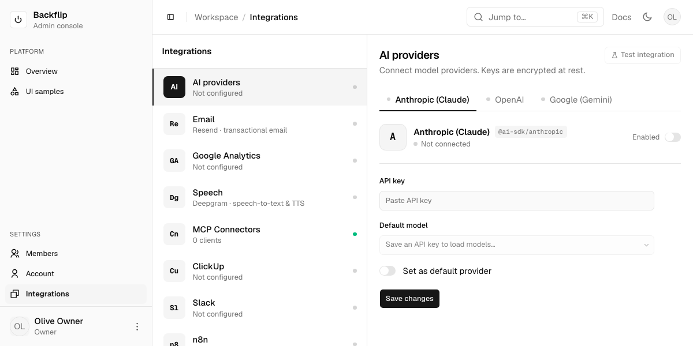

# Notes (L3) — ui

> L3 = how / volatile. AI writes free. Cites L2 IDs up. Matches code as-is.

## File map
- `packages/ui/src/components/*.tsx` — shadcn component set. Satisfies `L2-UI-01`.
- `packages/ui/src/lib/utils.ts` — `cn()`. Satisfies `L2-UI-02`.
- `packages/ui/src/styles/globals.css` — theme tokens + Tailwind `@source` globs. Satisfies `L2-UI-03`. `@source` paths are relative to this file (4 levels up = repo root): `../../../../apps/**`, `../../../../components/**`, `../**` (packages/ui itself). All consumer `.tsx` must be covered or their utility classes aren't generated.
- `packages/ui/components.json` — shadcn config. Satisfies `L2-UI-06`, `L2-UI-07`.
- `apps/web/app/layout.tsx` — mounts ThemeProvider + TooltipProvider + Toaster. Satisfies `L2-UI-04`, `L2-UI-09`.
- `apps/web/app/page.tsx` — public marketing homepage (RSC/SSR). Composes `_components/`: `SiteHeader`, `Hero`, `FeatureGrid`, `HowItWorks`, `WordmarkBand`, `SiteFooter`. Sets page `metadata`. Satisfies `L2-UI-11` (proposed).
- `apps/web/app/_components/*` — homepage sections (app-scoped, `L1-ARCH-07/08`): `site-header.tsx` (`"use client"` — sticky nav + wordmark + `ThemeToggle`, links use `Button render={<a/>}`), `theme-toggle.tsx` (dark/light switch via `useTheme`, mount-guarded; `variant` outline|ghost + `className` props — shared by public and admin headers), `brand-icon.tsx` (shared arc glyph SVG — used by the public wordmark and the admin sidebar logo tile: bordered `bg-card` tile + `text-primary` glyph on both), `hero.tsx` (headline + CTAs over CSS stripe texture, no image), `feature-grid.tsx` (5 `Card`s from `FEATURES`, remixicon icons), `how-it-works.tsx` (3-step band on `bg-muted`; "Clone" card CTA → GitHub repo (new tab), "Configure" card CTA → `/getting-started`, "Ship" card CTA → `/getting-started/start-building` (outline `Button render={<a/>}`)), `wordmark-band.tsx` (oversized `text-muted-foreground/20` accent), `site-footer.tsx`. Theme tokens only, no hex. Icons remixicon only.
- `apps/web/app/getting-started/page.tsx` — three-phase index (RSC, static): hero + `PHASES` sections (01 Discover / 02 Set up / 03 Start building), each a lead + guide cards; linked from the homepage "Configure" card. Satisfies `L2-UI-18`.
- `apps/web/app/getting-started/intro/page.tsx` — discovery page (RSC, static): what Backflip is, `IN_THE_BOX` + `AUDIENCE` card grids, CTA → setup wizard. Satisfies `L2-UI-18`.
- `apps/web/app/getting-started/start-building/page.tsx` — prompts-only page (RSC, static): `PROMPTS` (4 copy-ready coding-agent prompts — contact form, admin view, Resend notification, spam/polish) rendered via page-scoped `_components/prompt-block.tsx` (client — copy-to-clipboard prose card, wraps, no shell gutter). Linked from homepage "Ship" card. Satisfies `L2-UI-18`.
- `apps/web/app/getting-started/setup-on-digitalocean-droplet-docker-flavour/page.tsx` — placeholder (RSC, "Coming soon" badge): docker-flavour guide lands after the docker setup/deploy scripts are verified end-to-end; links to the pm2 guide + index. Satisfies `L2-UI-18`.
- `apps/web/app/getting-started/setup-on-digitalocean-droplet/page.tsx` — public guided deploy walkthrough (RSC shell, `metadata.title` "Setup on a DigitalOcean droplet"); composes `SiteHeader` → `GuideHero` → `SetupGuide` → `SiteFooter`. Prerenders static. See "Getting-started guide route"; satisfies `L2-UI-18`.
- `apps/web/app/getting-started/setup-on-digitalocean-droplet/_components/*` — page-scoped (`L1-ARCH-07/08`): `guide-hero.tsx` (RSC, homepage stripe-texture backdrop, smaller clamp), `setup-vars.ts` (plain module — `SetupVars`, `resolve()`, one builder per command block; `@spec L2-DEVOPS-01, L2-DEVOPS-02, L2-DEVOPS-06`), `variables-form.tsx` (client — the single shared form + its guidance layout), `field-guidance.tsx` (client — step-1 focus-driven help panel), `command-block.tsx` (client — copy-to-clipboard `<pre>` + `<placeholder>` token highlighting, `compact` variant), `setup-guide.tsx` (client island — owns `SetupVars` + step index, sessionStorage persistence, Back/Next/Reset), `setup-steps.tsx` (client — `STEPS` metadata + `StepBody`, all guide copy; step 1 "Get a droplet" — image/size/ssh-key/DNS checklist, ssh-keygen block (keygen lives here, not in the variables sidebar) + DigitalOcean referral-link CTA (m.do.co, labeled as referral); step 2 "Clone" — local software checklist (git, Node 24 + corepack, OpenSSH/openssl) + clone/install block + Claude-Code-primary note (other agents untested); final Summary step renders + downloads `backflip-setup-summary.txt` via Blob — values incl. owner password with a keep-private warning, plus day-two command reference from `summaryDocument()` in setup-vars), `wizard-stepper.tsx` (client — numbered clickable progress dots).
- `apps/web/app/backflip/(protected)/users/page.tsx` — admin Members surface (RSC). Selects `users` display fields + `emailVerified`/`createdAt` (no hash), newest first; derives per-member `loginMethods`, `usesGoogle`, `status` (Active/Pending) + workspace counts; renders `MembersView`. Sidebar `Users` links here. (Members master-detail — see "Members (design 1A)".)
- `apps/web/app/backflip/(protected)/ui-samples/page.tsx` — component demo, admin-only (moved from public `/ui-samples`; auth-gated by the edge proxy, second Platform nav item below Overview, capability `dashboard`). Public header/footer/hero links now point to `/getting-started`. Dashboard/masonry layout reproducing the `base-mira` create-preview; exercises ~50 components (item, field, input-group, native-select, toggle-group, chart/recharts, empty, spinner, progress, calendar, radio, table, tabs, accordion, …). `d` = dark toggle. Satisfies `L2-UI-05`, `L2-UI-12`. Note: uncontrolled `defaultValue` passed to base-ui ToggleGroup/Slider must be stable module-scope refs (base-ui warns on identity change per render).
- `apps/web/next.config.ts` — `transpilePackages: ["@workspace/ui"]`. Satisfies `L2-UI-10`.

## Admin flat restyle ("Flat Admin" design) — L2-UI-03
Protected `/backflip/*` surface restyled to a flat, hairline aesthetic (imported from claude.ai/design "Flat Admin"). **Theme tokens unchanged** — already flat-neutral; radius already matches (cards `rounded-xl` ≈ 11px, controls ≈ 7.6px). Restyle is component/layout only.
- Shared primitives: `(protected)/_components/page-heading.tsx` — `PageHeading` (large tracking-tight title + muted subtitle + optional trailing `action`) and `SectionLabel` (uppercase `text-xs` micro-label). Layout-scoped (`L1-ARCH-08`).
- `section-cards.tsx` — flat stat cards: `SectionLabel` + big `tabular-nums` value + optional unit / emerald·red delta / slim progress bar / emerald status dot + muted caption. No `Card`/`Badge` chrome.
- `site-header.tsx` — see "Admin chrome (design-matched)".
- `account/page.tsx` — design "My account": `PageHeading` + profile summary card + bordered "Account details" list (`border-t` hairline rows wrapping Profile/Email/Password sections) + Login methods card. Section summary rows reshaped to `w-32` muted label | value | trailing button; email shows mono value + emerald "Verified" pill; password shows masked dots. Edit forms unchanged (functionality preserved).
- `settings/page.tsx` — Integrations master-detail (see "Integrations page"). `@spec L2-AI-01, L2-EMAIL-01` unchanged.
- Menu unchanged: Dashboard/Users/Account/Settings (no items added).
- Green pills use `emerald-*` utilities (only non-token color; light+dark variants). Everything else theme tokens.

## Admin chrome (design-matched) — L2-UI-03
Sidebar + header + shell now match the Flat Admin design layout (a later pass superseded the earlier "sidebar not restyled" note). Menu items/routes unchanged (Dashboard/Users/Account/Settings).
- `(protected)/layout.tsx` — sidebar switched from `variant="inset"` (floating) to **flush** (default `variant="sidebar"`, border-right); `--sidebar-width: 15.5rem`, `--header-height: 3.5rem`; content area on a soft `bg-muted/40` canvas so white panels/cards pop; passes `userName`/`userInitials` to the header.
- `app-sidebar.tsx` (client) — dark rounded **logo square** (`RiShapesLine`) + "Backflip" / "Admin console" subtitle; nav split into labeled groups **Platform** (Overview) + **Settings** (Users, Account, Integrations) via `SidebarGroupLabel`; the Settings group is `mt-auto` (pinned to the bottom, above the user footer, which has `border-t border-sidebar-border`); **active** state from `usePathname` (`isActive`, exact for `/backflip`, prefix otherwise); groups filtered by `can(role, cap)`.
- `nav-user.tsx` — footer chip now shows role (was email); dropdown (Account / Log out) unchanged.
- `site-header.tsx` (client) — `usePathname` breadcrumb trail (e.g. Settings / My account), `SidebarTrigger`, right-aligned Docs link + `ThemeToggle` (shared `app/_components/theme-toggle.tsx`, ghost `size-7`) + avatar. Breadcrumb `nav` and the right cluster are both shrinkable (`min-w-0`, `truncate` / `shrink`) so the header never forces horizontal scroll on narrow viewports.
- Removed: `nav-main.tsx`, `nav-secondary.tsx` (nav inlined into `app-sidebar`).
- Nav labels renamed to design: **Overview** (was Dashboard) + **Integrations** (was Settings; icon `RiCheckboxMultipleBlankLine`). Routes/capabilities unchanged (`/backflip`, `/backflip/settings`, caps `dashboard`/`settings`). Menu item type `text-[13px]`, group labels `text-[11px]` to match a1.
- **Full-bleed content:** shell (`layout.tsx`) drops all outer padding/gap — content area is edge-to-edge on a `bg-muted/40` canvas. Master-detail pages (`MembersView`, `IntegrationsView`) are one flush region, no rounded cards/gaps (list `lg:w-[372px] lg:border-r` | detail `flex-1` | rail `w-[300px] xl:border-l p-4`). **Split surfaces:** shell root stays `bg-card` (detail + rail sit on it, rail keeps its `bg-muted/50` tint over card); the **list column is explicitly `bg-background`** so it matches the header/`SidebarInset` canvas. (Overview/Account differ: their canvas = ui-samples `bg-muted dark:bg-background`, content surface = `bg-card`.) Holds in both mobile states (list `w-full` below lg, detail `flex-1` when `mobileDetail`). Padded pages own their padding: dashboard + `account` wrap in `p-4 md:p-6` (account stays `max-w-5xl` centered).
- `header-search.tsx` + `overview-jump.tsx` — quick-jump: `⌘K` `CommandDialog` (cmdk) over shared `jump-targets.ts` (`JUMP_GROUPS`) → `router.push`. Compact button in `site-header`; large field on Overview.
- Sidebar `collapsible="icon"` (was offcanvas) → contracted = 60px icon rail (design 1B); `--sidebar-width-icon: 3.5rem`; logo/user buttons get `group-data-[collapsible=icon]:p-0!` so tile/avatar fit. Header divider is a plain `h-4 w-px bg-border` span (base-mira `Separator` forces `data-vertical:self-stretch`, so it stretched/misaligned — a fixed span centered by the header's `items-center` is reliable).

## Overview page — design 5A (L2-UI-03)
`/backflip` rebuilt from generic stat-cards/chart/table to the 5A home. **Real data only.**
- `page.tsx` (RSC) — greeting (`Welcome back, {firstName}`, real date) + `OverviewJump` + 3 real stat cards (Members total/active/pending, Integrations enabled + health dot, Pending) + 2 info cards: **Finish setting up** (4 real steps derived from name/user-count/ai/email config) + **Recent members** (newest 4 from `users`). Full-bleed, `max-w-[900px]` centered; canvas mirrors ui-samples (`bg-muted dark:bg-background`, hero stripe backdrop removed), each card `rounded-xl border bg-card p-5` (was a flat `bg-card` page with borderless-bg cards).
- Removed: `section-cards.tsx`, `dashboard-chart.tsx`, `recent-table.tsx`.
- `_components/overview-jump.tsx` — large quick-jump field opening the shared command palette.

## Members page — design 1A master-detail (L2-UI-03; auth domain UI)
`/backflip/users` ported from a flat card list to a 3-column master/detail (design "Flat Admin" 1A). **Layout-faithful, real-data-only** — no schema/action changes; unsupported design chrome omitted.
- `users/_components/types.ts` — `Member` (+ derived `status`, `usesGoogle`, `joined`), `WorkspaceCounts`. `MemberStatus` = `active` (has login method OR `emailVerified`) | `pending` (neither). No "suspended" (no backend).
- `members-view.tsx` (client shell) — selection + `mode` (overview/edit/new) + search/filter state; `flex h-full min-h-0 bg-card` 3 cols (list `lg:w-[22rem]` + `bg-background`, detail `flex-1` + `bg-card`, rail `xl:` only). < lg: list/detail stack via `mobileDetail` toggle + back control.
- `members-list.tsx` — header + count + `New` (owner), search, filter pills (All/Active/Pending), rows (avatar, name + mono email, Google icon from `loginMethods`, status dot), selected = `border-l-2 border-primary bg-muted`.
- `member-detail.tsx` — reproduces design 1a: 52px avatar header (status dot · role, Edit); **Overview** `justify-between` def-rows (Member ID mono = `users.id`, Email + "Verified", Role, Sign-in method + circle-`G` `GoogleMark`, Date added = `createdAt`); header `HeaderActions` = Edit + kebab (`RiMore2Line`, hidden for self) → **Remove user** with an `AlertDialog` confirm → new `deleteUser` action; on success `onRemoved` clears selection + revalidates. **Edit** — "Edit member" title + 2-col grid (Full name, Email, Role full-span) → existing `updateUser` (self-role-lock kept); **New** form (name/email/role radio-cards/optional password) → existing `POST /api/backflip/users` + `router.refresh()`. 1a's Team/Two-factor/Status-edit/kebab omitted (no backend). Folds in the removed dialogs.
- `member-rail.tsx` — permissions card (✓/— live from `can(member.role, cap)`), workspace stat counts, static help card.
- Omitted (no backend): bulk suspend/delete, kebab disable/remove/mark-unverified, Team, Two-factor, Suspended status, last-active.
- Removed: `users-list.tsx`, `add-user-dialog.tsx`, `edit-user-dialog.tsx`. `_actions.ts` `updateUser` + REST route unchanged.

## Account page — design 4a (L2-UI-03; auth domain UI)
`/backflip/account` ported to the "My account" 2-column: details left, security rail right. **Real-data-only**, actions unchanged.
- `account/page.tsx` — also selects `emailVerified`. Full-bleed 4a layout: main column (`max-w-[900px]` content, matches Overview card width, `p-6 lg:p-8`) + a right rail with `border-l` (stacks under main < lg with `border-t`). Passes `emailVerified` + `loginMethods` to rail + email pill.
  - **Canvas mirrors ui-samples** (`bg-muted dark:bg-background`), main column and rail alike; only cards keep `bg-card` (profile summary, "Account details" list, both rail cards). Was `bg-card` main + `bg-muted/50` rail. Same treatment as the Overview page; inline edit forms stay `bg-muted/40`.
  - Rail width is stepped: `lg:w-64` (256px) → `xl:w-80` (320px), so the main column keeps usable width on ~1200px viewports instead of being squeezed by a fixed 320px rail. Rail and main content both carry `min-w-0` so neither blocks shrinking.
- `_components/profile|password|email-section.tsx` — summary→edit switched from swap to **inline-expand** (row stays; form drops below on `bg-muted/40`).
  - Email: 2-step `Stepper` (Details → Verify). Step 1 = real `requestEmailChange` (new email + current-password step-up when `hasPassword`); on `state.ok` → step 2 amber "check your inbox" (link-based, deferred swap). **No 6-digit codes.** Verified pill driven by real `emailVerified`.
  - Password: `changePassword` unchanged + a **client-only strength meter** (`strength()` heuristic: length + char-class → 4-seg bar) + show-passwords toggle.
- `_components/account-rail.tsx` — Account security card (Email Verified/Unverified from real state, Sign-in method badges) + static "Why verify twice?" info card.
- Omitted (no backend): Two-factor, last sign-in, session/device list, danger-zone/deactivate.

## Integrations page — design 2a master-detail (L2-UI-03; ai + email domains UI)
`/backflip/settings` (owner-only) ported to a master-detail of the two **real** integrations. **Real-data-only**, actions/encryption unchanged; keys stay masked (no Reveal).

- Screenshot: `docs/assets/admin-integrations.png` (1200×600, unconfigured state, demo seed user). Also embedded in the repo `README.md`. Regenerate with `.screenshots/shoot.mjs` (gitignored local Playwright driver) and re-copy.
- `settings/page.tsx` — same `aiConfig`/`emailConfig` fetch + `ProviderConfig[]`/`EmailConfig` shapes; renders `IntegrationsView`.
- `_components/integrations-view.tsx` (client shell) — 3-col: list (2 rows: "AI providers · N connected", "Email · Resend", status dots) + detail + `xl:` rail; `mobileDetail` stack < lg. List column `bg-background` (header canvas), detail `bg-card`, rail `bg-muted/50` over the shell's `bg-card`.
- `ai-integration.tsx` — provider tabs (Anthropic/OpenAI/Google, status dot) + `ProviderPane` (`key`ed per provider): design-2a header (logo tile · `PACKAGE` mono badge · connected status · **Enabled** toggle) over credentials (masked key) + Default-model select + "Set as default" toggle + Save (`saveAiConfig`), then Available-models list. Models list is static (`MODELS`) pending L2-AI live-models approval.
- `email-integration.tsx` — design 2a Resend pane: header (Re tile · `resend` mono chip · Connected status · Enabled toggle) over inlined credentials form (masked key, Default from address, From name, Reply-to) → `saveEmailConfig`. Sending-domain/Reveal/Disconnect omitted (no backend). `email-config-form.tsx` slimmed to just the `EmailConfig` type.
- `integrations-rail.tsx` — About service + docs link + "keys encrypted at rest" note.
- `ai-config-form.tsx` — plain module (no client): exports `ProviderConfig`, `LABEL`, `PACKAGE`, `MODELS`. `ProviderForm`/`AiConfigForm` removed (form inlined as `ProviderPane`).
- Removed: `ai-section.tsx`, `email-section.tsx` (view/edit-toggle wrappers superseded).
- Omitted (no backend): Reveal key, Analytics/PostHog, usage metrics, sending-domain verification, org-id/base-url.

## Getting-started guide route (public) — `L2-UI-18`
`/getting-started/setup-on-digitalocean-droplet` — human-facing guided setup for deploying to a DigitalOcean droplet (pm2 flavor + native Postgres). Renders the real `devops/` commands with the operator's variables substituted.
- **Six-step wizard, one step visible at a time** (was one long scrolling page). Order: 1 Variables (the form) → 2 Droplet → 3 Database → 4 Env files → 5 Deploy → 6 Admin. `setup-steps.tsx` owns the copy: `STEPS` (id/title/short/lead, index = step − 1, `LAST_STEP`) + `StepBody` switching on the index; `setup-guide.tsx` is shell only (position, persistence, nav, privacy note, docs links); `wizard-stepper.tsx` is the numbered indicator.
  - Stepper dots are **all** clickable (reading order, not a gate); states = upcoming (muted) / current (filled `primary`) / done (`primary/10` + check), connectors tint as you pass them. Per-dot `sr-only` "Step N: <title>"; `aria-current="step"` on the current dot. Below `sm` labels are hidden and each item shrinks to the dot so six dots + connectors fit 320px (`L2-UI-16`).
  - Footer nav: Back (`outline`, disabled on step 1) · `n / N` · Next (disabled on last step); `Step n of 6` micro-label + `Reset` sit above the stepper. Any step change scrolls a sentinel `div` at the top of the island into view.
  - Every executable command box carries a `RunOn` micro-label above it ("Run on: your machine — repo root", "…any shell" for the `openssl` generators). File-content boxes keep their filename label and `prompt={false}` instead.
  - Step 5 also shows the fast path `devops/deploy-for-pm2-build-locally.sh` (`firstDeployLocalBuildCommand`) — identical flags, local typecheck+build, ships a tarball.
- **Client-only, sessionStorage-only.** No server action, no route handler, no fetch, no `localStorage`/cookies. `SetupGuide` mirrors state into `sessionStorage` under `backflip.setup.vars` (JSON) + `backflip.setup.step` (index) — same tab only, gone when it closes. A lock callout under the nav states this on every step. Values reach the outside world only via the operator's own clipboard.
  - **`adminPassword` is never persisted** — memory only, `PERSISTED` in `setup-guide.tsx` lists the seven keys that are; its inline hint says "Not stored — refill after a reload." and its guidance panel repeats it.
  - Hydration-safe: first render is always `EMPTY_VARS` + step 0, storage is read in a mount effect (`restored` flag gates writes so the read can't be clobbered). Reads are validated (known keys, `typeof value === "string"`, step clamped to 0…`LAST_STEP`) — storage is untrusted input. Every access is `try`/`catch`ed (Safari private mode throws); failure degrades to "doesn't remember". `Reset` clears both keys + state and returns to step 1.
  - `L2-UI-18` amended (approved): variables stay in the browser via component state + tab-scoped `sessionStorage`; admin password never persisted.
- Single shared form in step 1 (host, ssh key path, domain, certbot email; optional app name + port; owner email + password). All command blocks re-render live from it. The form no longer renders its own header — the wizard shell prints `STEPS[0].title`/`lead`.
- **Step 1 layout: form left, guidance panel right** (`variables-form.tsx` owns both columns; the shell is untouched, so steps 2–6 keep their single-column bodies).
  - Fields are **one column** in wizard order (host → ssh key → domain → LE email → optional group → owner group), card capped at `max-w-[26rem]`. Guidance column `lg:w-80`, `lg:sticky lg:top-20` (clears the sticky `SiteHeader`, `h-14`); below `lg` the two stack, both capped at 26rem. No page-level horizontal scroll at 1280/900 (`L2-UI-16`).
  - `field-guidance.tsx` — `guidanceFor(key, vars)` returns `{ title, body[], extra? }` per `SetupVars` key; the panel renders whichever field last held focus. Drives off `onFocus` only, so a blur keeps the last guidance on screen; before any focus it shows "Click into a field to see what it needs." Body is `aria-live="polite"`.
  - The old per-field `FieldDescription` hints moved into that panel (form keeps labels + placeholders only). Exception: the owner password keeps a one-line inline "Not stored — refill after a reload." **and** the fuller sidebar note.
  - ssh-key guidance carries a `CommandBlock ... compact` with `chmod 600 <path>`, substituting the typed path (falls back to a highlighted `~/.ssh/<your-key>`). `compact` = wrapping `<pre>` + icon-only copy button, added for narrow columns; the default (scrolling + labelled button) is what every other step still uses.
  - Owner-email guidance prints the live `resolve(vars).appUrl` + `/backflip`, so it shows the real console URL once the domain is filled.
  - **"Optional — multi-instance droplets" is a collapsed disclosure** (`@workspace/ui/components/collapsible`, base-ui): `CollapsibleTrigger` = chevron + the existing uppercase micro-label; chevron rotates via `group-data-[panel-open]:rotate-90` (base-ui puts `data-panel-open` on the trigger).
    - Open state is `optionalToggled ?? hasInstanceOverride(vars)` — derived, not an effect: restored sessionStorage values land *after* mount, so a non-default `appName`/`appPort` auto-expands the group when it arrives; the first manual toggle then wins for good. (An effect + `setState` here trips `react-hooks/set-state-in-effect`.)
    - "Non-default" = trimmed, non-empty, `!== DEFAULT_APP_NAME`/`DEFAULT_APP_PORT` — the same test `resolve()` uses to decide whether to append `-n`/`--app-port`, so a collapsed group never hides a value that changes a command.
- Empty variable → visible `<placeholder>` token (`resolve()` in `setup-vars.ts`), highlighted by `command-block.tsx` so a gap is never silently copied. Copy uses `navigator.clipboard.writeText` with a 1.6s "Copied" swap; clipboard rejection is a no-op (no toast — page has no `Toaster` dependency of its own beyond root layout).
- `-n <app-name>` / `--app-port <port>` are appended **only** when the entered value differs from the script defaults (`backflip` / `3070`), so single-instance operators get the short command.
- Command strings are the single source of drift risk: they duplicate `devops/*.sh` signatures. All of them live in `setup-vars.ts` behind one builder each — change a script flag → change that module. Tagged `@spec L2-DEVOPS-01, L2-DEVOPS-02, L2-DEVOPS-06`.
- Owner-seed block follows `devops/docs/droplet-setup.md` verbatim (`\$HOME` escaped — the unescaped form expands to root's `$HOME` in the remote shell before `sudo -u backflip`, so nvm isn't found). `printf` args are single-quoted: passwords carry `$`/`!`/spaces, and an unquoted `<placeholder>` would be shell redirection.
- Layout: `max-w-6xl` (matches the site header container), homepage typography (`font-heading`, `clamp()` h1, `text-muted-foreground` leads), no new colors. Command `<pre>` scrolls in its own `overflow-x-auto` box → no page-level horizontal scroll (`L2-UI-16`). Hero (`guide-hero.tsx`) and `metadata` unchanged by the wizard rework. The "Where the full docs live" card was removed (kept users focused; repo docs remain linked from README/devops.md).
- Not linked from `SiteHeader`/`SiteFooter` yet — reachable by URL only.
- Gotcha found here: a JSXText node containing `&apos;` loses its **leading space** through the SWC/Turbopack JSX transform (`<code/>` glued to the next word), and prettier reflows an explicit `{" "}` away again. Repo convention is the typographic `’` written literally — keep it; don't reintroduce HTML entities in JSX text.

## Form-element sizing (house tweak, padding only)
Form primitives get +2px padding + grown heights over base-mira defaults — **font sizes unchanged**: `button` (size + icon variants), `input`, `textarea`, `native-select`, `select` trigger. Arbitrary px (`px-[10px]`, `py-[4px]`, `h-8`) where no clean Tailwind step. No theme-level text-scale bump (reverted). `cursor: pointer` on buttons is a base-layer rule. Re-`shadcn add` would overwrite these.

## Installed components (60)
Full `base-mira` registry (added via `shadcn add -a -c packages/ui`):
accordion, alert, alert-dialog, aspect-ratio, attachment, avatar, badge, breadcrumb, bubble,
button, button-group, calendar, card, carousel, chart, checkbox, collapsible, combobox, command,
context-menu, dialog, direction, drawer, dropdown-menu, empty, field, hover-card, input,
input-group, input-otp, item, kbd, label, marker, menubar, message, message-scroller,
native-select, navigation-menu, pagination, popover, progress, radio-group, resizable,
scroll-area, select, separator, sheet, sidebar, skeleton, slider, sonner, spinner, switch,
table, tabs, textarea, toggle, toggle-group, tooltip.

Hook: `src/hooks/use-mobile.ts` (sidebar).

## Deps added for components
- `sonner` — toast (needs `<Toaster/>`).
- `react-day-picker` + `date-fns` — calendar.
- `recharts` — chart.
- `cmdk` — command / combobox.
- `embla-carousel-react` — carousel.
- `input-otp` — input-otp.
- `react-resizable-panels` — resizable.
- `@shadcn/react` — registry runtime helpers.

## Deviations
- `spinner.tsx` — registry shipped `React.ComponentProps<"svg">`; retyped to `ComponentProps<typeof RiLoaderLine>` (remixicon `children: undefined` clash). Local edit; re-check on `shadcn add` overwrite.

## Base scale
- `globals.css` sets `html { font-size: 17px }` (up from 16). base-mira ships compact; this scales all rem sizes (text, control heights, padding, gaps) ~6% for a slightly larger, roomier feel. Tune this single value to rescale the whole UI.

## Reference
- Admin/dashboard UI is built from **shadcn blocks**: https://ui.shadcn.com/blocks — browse for layouts/components. In use: `login-03` (login), `dashboard-01` (admin shell), `sidebar-08` (earlier shell). Clone source to `.external-repos/` (gitignored) when replicating; port `asChild`→`render`, lucide/tabler→remixicon.

## Composition (base-mira / base-ui)
- base-mira components compose via base-ui `useRender` — pass `render={<el/>}` with children as siblings, NOT Radix-style `asChild` + child. E.g. `<SidebarMenuButton render={<a href={url} />}>…</SidebarMenuButton>`, `<Collapsible render={<SidebarMenuItem />}>`, `<DropdownMenuTrigger render={<SidebarMenuButton />}>`.
- When porting shadcn new-york blocks (which use `asChild`), rewrite to `render`. Also map lucide icons → remixicon.
- **Link-buttons need no `nativeButton`.** `Button` (`packages/ui/src/components/button.tsx`) derives base-ui's `nativeButton` from the `render` element: `render.type === "button"` → `true`, any other element (`<a>`, `<Link>`) → `false`. Explicit `nativeButton` still wins; function-form `render` can't be inspected and keeps base-ui's `true` default. Call sites write `<Button render={<a href="…" />}>` and stay warning-free.

## Fixed
- `@source` globs in globals.css were one level short (`../../../apps` → `packages/apps`, nonexistent). Tailwind never scanned `apps/web`, so app-level utility classes (page layout on `/ui-samples`) weren't generated → page rendered unstyled vs shadcn preview. Corrected to `../../../../` (repo root).
- **Admin shell forced page-wide horizontal scroll.** `SidebarInset` (`sidebar.tsx`) was `w-full flex-1` with no `min-w-0`. Flex items default to `min-width: auto`, so `main` could not shrink below its content's min-content width — at 1200×600 on `/backflip/account` it rendered 1020px inside a 936px slot, pushing `document.scrollWidth` to 1284. Added `min-w-0`. Shell-wide: header and every admin page overflowed identically, not just account.
- **Base UI button-semantics warning ×4 on the public homepage.** `Button` passed base-ui's default `nativeButton: true` while rendering `<a>` (site-header ×2, hero ×2), so base-ui warned that native button semantics were lost. Fixed centrally by inferring `nativeButton` from `render` (see "Composition") rather than patching call sites — the same latent bug existed at `app-sidebar.tsx` ×2, `verify-email-confirm.tsx`, `forgot-password-form.tsx`, `reset-password-form.tsx`. Verified: 0 console errors/warnings across `/`, `/ui-samples`, `/backflip/login`, `/backflip/forgot-password`, `/backflip`, `/backflip/users`, `/backflip/account`, `/backflip/settings`.
- **Admin header overflowed below `lg`.** The right cluster (`ml-auto`) plus breadcrumb could not compress — +33px at 768. Cluster got `min-w-0 shrink`, breadcrumb `nav` got `min-w-0 truncate`, `header-search.tsx` button got `min-w-0 shrink`. Verified no horizontal overflow at 1200/1024/900/768/640.

## TODO
- _(none)_ — admin chrome (sidebar/topbar) landed; flat-restyled (see "Admin flat restyle").

## ADR
_(none yet)_
